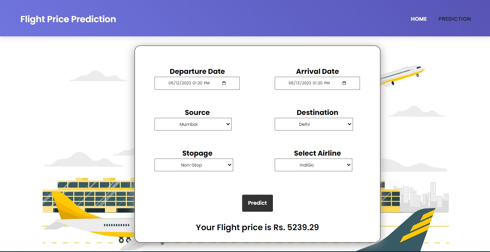

# Flight-Fare-Prediction
   

> A Flight price prediction application that predicts fares of flights for a particular date based on various parameters like Source, Destination, Stops & Airline. Data used in this project is scraped from an online ticket booking website 'Ease my Trip' using a Python module name BeautifulSoup. The dataset goes through Data Cleaning, Data Wrangling, and Exploratory Data Analysis which gives insights about the data and later uses Machine Learning techniques to train the data for prediction.
It is a regression problem that is solved using RandomForestRegressor ML Algorithm which generates accurate results for price prediction. A web application is created using Flask through which users can interact and get accurate predictions of flight fares.

## Models with their Accuracy of Prediction

| Type of Model            | Accuracy |
| ------------------------ | -------- |
| Linear Regression        | 72.00%   |
| XGBoost                  | 82.00%   |
| ExtraTreeReressor        | 93.70%   |
| Random Forest            | 93.70%   |

## Features:

- Departure & Arrival Date
- Source (4 Destinations were selected for this project)
- Destination (4 Destinations were selected for this project)
- Total stops
- Selected Airlines
- Price (Target)

## NOTE

> You can access the website live at: https://flight-fare-prediction-i1mr.onrender.com/ <br>
Python version 3.10.9 was used for the whole project.<br>

## Steps to run this application in your system

1. Clone or download the repo.
 
2. Open the command prompt in the downloaded folder.

3. Install all the dependencies:

```
pip install -r requirements.txt
```

4. Run the application

```
python app.py
```

## Technologies Used:

     

## Sample images of the web application

### Prediction Page

<br>

### Predictions
In the Below predictions we have selected the source as Mumbai & the destination as Delhi, the flight would be non-stop & the airline we have selected is IndiGo and the price we got is around Rs 5239 
<br>


<br>

